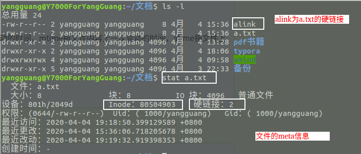

# Linux知识点

## `Inode`介绍

### `Inode`包含的信息

- **文件类型**：例如常规文件、目录、符号链接等。
- **文件权限**：如读、写、执行权限。
- **文件所有者和组**：文件的所属用户（user）和所属用户组（group）。
- **文件大小**：文件的大小（以字节为单位）。
- **文件的创建、修改、访问时间**：文件的时间戳信息。
- **文件的链接数**：硬链接数量。
- **指向文件数据块的指针**：文件的实际数据存储在硬盘的具体位置。



## 软链接和硬链接

```
// 指令
软：ln - s
硬：ln
```

| 特性             | 软链接                              | 硬链接                                                 |
| ---------------- | ----------------------------------- | ------------------------------------------------------ |
| 目标             | 指向文件路径（文件名）              | 指向文件的`inode`                                      |
| 跨文件系统       | 可以跨越文件系统                    | 不能跨越文件系统                                       |
| 对文件删除的影响 | 删除目标文件，软链接变为“断链”      | 删除其中一个硬链接，文件内容不受影响，除非删除所有链接 |
| 链接到目录       | 可以指向目录                        | 通常不允许硬链接指向目录                               |
| `inode`共享      | 不共享`inode`，软链接是一个新的文件 | 共享`inode`，所有硬链接指向同一文件                    |

#### 硬链接为什么不能跨文件系统

- **软链接**只是保存了目标文件的路径信息，而路径对于文件系统是独立的（不依赖具体的存储介质），所以即使目标文件在另一个文件系统中，也可以通过软链接找到目标文件。
- **硬链接**中每个文件系统都有自己独立的`inode`表，不同文件系统的`inode`是相互隔离的。因此，硬链接只能在相同的文件系统中指向一个文件的`inode`。

## Linux中文件类型

- **普通文件（-）**：用于存储信息和数据， Linux 用户可以根据访问权限对普通文件进行查看、更改和删除。比如：图片、声音、PDF、text、视频、源代码等等。
- **目录文件（d，directory file）**：目录也是文件的一种，用于表示和管理系统中的文件，目录文件中包含一些文件名和子目录名。打开目录事实上就是打开目录文件。
- **符号链接文件（l，symbolic link）**：保留了指向文件的地址而不是文件本身。
- **字符设备（c，char）**：用来访问字符设备比如键盘。
- **设备文件（b，block）**：用来访问块设备比如硬盘、软盘。
- **管道文件(p，pipe)** : 一种特殊类型的文件，用于进程之间的通信。
- **套接字文件(s，socket)**：用于进程间的网络通信，也可以用于本机之间的非网络通信。

## Linux目录树

### 常见目录说明

- **/bin：** 存放二进制可执行文件(ls、cat、mkdir 等)，常用命令一般都在这里；
- **/etc：** 存放系统管理和配置文件；
- **/home：** 存放所有用户文件的根目录，是用户主目录的基点，比如用户 user 的主目录就是/home/user，可以用~user 表示；
- **/usr：** 用于存放系统应用程序；
- **/opt：** 额外安装的可选应用程序包所放置的位置。一般情况下，我们可以把 tomcat 等都安装到这里；
- **/proc：** 虚拟文件系统目录，是系统内存的映射。可直接访问这个目录来获取系统信息；
- **/root：** 超级用户（系统管理员）的主目录（特权阶级^o^）；
- **/sbin:** 存放二进制可执行文件，只有 root 才能访问。这里存放的是系统管理员使用的系统级别的管理命令和程序。如 ifconfig 等；
- **/dev：** 用于存放设备文件；
- **/mnt：** 系统管理员安装临时文件系统的安装点，系统提供这个目录是让用户临时挂载其他的文件系统；
- **/boot：** 存放用于系统启动时使用的各种文件；
- **/lib 和/lib64：** 存放着和系统运行相关的库文件 ；
- **/tmp：** 用于存放各种临时文件，是公用的临时文件存储点；
- **/var：** 用于存放运行时需要改变数据的文件，也是某些大文件的溢出区，比方说各种服务的日志文件（系统启动日志等。）等；
- **/lost+found：** 这个目录平时是空的，系统非正常关机而留下“无家可归”的文件（windows 下叫什么.chk）就在这里。

## 指令

### `df`和`du`

`df` 命令用于查看**文件系统**的整体磁盘空间使用情况，包括可用空间和已用空间。

#### 常用语法：

```css
df [选项] [文件]
```

#### 常用选项：

- `-h`：以**人类可读的方式**显示结果（单位为 KB, MB, GB）。
- `-T`：显示文件系统的类型。
- `-i`：显示 inode 的使用情况。

`du` 命令用于查看**具体目录或文件**的磁盘使用情况。

#### 常用语法：

```css
du [选项] [路径]
```

#### 常用选项：

- `-h`：以**人类可读的方式**显示结果（单位为 KB, MB, GB）。
- `-s`：显示总计大小，省略细节。
- `-a`：显示所有文件的磁盘使用情况，而不仅仅是目录。

### find

​	`find` 命令是 Unix/Linux 系统中一个非常强大的工具，用于在文件系统中查找文件和目录。它可以根据各种条件进行搜索，提供了灵活的选项和强大的功能。下面将详细介绍 `find` 命令的用法、选项以及一些常见示例。

### 基本语法

```bash
find [路径] [选项] [条件] [动作]
```

- **路径**：指定要搜索的目录，`.` 表示当前目录，`/` 表示根目录，`~` 表示当前用户的主目录。
- **选项**：用来修改 `find` 命令的行为。
- **条件**：指定查找文件的标准（如文件名、文件类型、文件大小等）。
- **动作**：指定对找到的文件执行的操作（如打印、删除等）。

### 常用选项

- `-name`：根据文件名查找。
- `-iname`：不区分大小写地根据文件名查找。
- `-type`：根据文件类型查找（`f`：普通文件，`d`：目录，`l`：符号链接等）。
- `-size`：根据文件大小查找。
- `-mtime`：根据文件的修改时间查找（例如 `-mtime +7` 查找7天前修改的文件）。
- `-atime`：根据文件的访问时间查找。
- `-ctime`：根据文件的状态改变时间查找。
- `-user`：根据文件所有者查找。
- `-group`：根据文件所属组查找。
- `-perm`：根据文件权限查找。
- `-exec`：对找到的文件执行命令。

### 常用条件和动作

- `-print`：默认动作，打印找到的文件路径。

- `-delete`：删除找到的文件。

- `-exec`：对找到的文件执行一个命令，例如：

  ```bash
  find . -name "*.txt" -exec cat {} \;
  ```

  这条命令会查找当前目录及子目录下所有`.txt` 文件，并使用 `cat`命令打印它们的内容。

### `cp`和`mv`的区别

**操作方式**：

- `cp` 是**复制**，源文件保持不变，目标位置会有一个新的副本。
- `mv` 是**移动**，源文件被转移到目标位置，原位置将不再存在该文件。

**文件删除**：

- `cp` 操作后，源文件仍然存在。
- `mv` 操作后，源文件将从原位置删除。

**重命名**：

- `cp` 没有重命名功能，它只能复制文件。
- `mv` 可以用来重命名文件或目录。

### `cat`和`grep`

#### **`cat`（concatenate and display files）**

- **功能**：`cat` 的主要功能是**显示文件的内容**，还可以将多个文件的内容**连接**在一起显示或保存为新的文件。

- 常见用途：

  - 显示文件的内容。
  - 合并多个文件的内容。
  - 创建或编辑文件（通过重定向符号 `>` 或 `>>`）。

- 示例：

  ```bash
  cat file.txt
  ```

  这条命令会将`file.txt`的内容在终端中输出显示。

#### **`grep`（global regular expression print）**

- **功能**：`grep` 的主要功能是**在文件中搜索**特定的字符串或模式，并只显示包含该字符串的行。它擅长通过**正则表达式**进行模式匹配。

- **常见用途**：

  - 在文件中查找特定文本。
  - 过滤或搜索输出中的特定行。
  - 查找匹配的模式，并可以结合其他命令使用（通过管道 `|`）。

- **示例**：

  ```bash
  grep "log" file.txt
  ```

  这条命令会搜索 `file.txt` 中所有包含 "log" 的行并输出。

| **功能/特点**    | **`cat`**                            | **`grep`**                              |
| ---------------- | ------------------------------------ | --------------------------------------- |
| **主要用途**     | 显示或连接文件内容                   | 搜索文件中的特定字符串或模式            |
| **输出方式**     | 输出整个文件的内容                   | 只输出与搜索模式匹配的行                |
| **搜索能力**     | 无法搜索内容                         | 能够根据字符串或正则表达式进行内容搜索  |
| **模式匹配**     | 不支持                               | 支持正则表达式匹配                      |
| **输出控制**     | 显示文件的全部内容                   | 只显示符合条件的部分内容                |
| **处理多个文件** | 可以连接多个文件并显示或保存为新文件 | 可以在多个文件中查找匹配的字符串        |
| **管道和组合**   | 通常与其他命令组合输出文件内容       | 常用于过滤命令的输出或组合其他命令      |
| **行号显示**     | 不显示行号                           | 可以显示包含匹配内容的行号（`-n` 选项） |

### 文件压缩

```
压缩：tar -zcvf
解压：tar - xvf
```

### 文件传输

#### **`scp`（Secure Copy Protocol）**

- **用途**：通过 SSH 协议，在本地和远程系统之间传输文件，确保传输过程是加密的。

- **语法**：

  ```bash
  scp [options] source_file user@remote_host:/path/to/destination
  ```

  - `source_file`：本地文件路径。
  - `user@remote_host`：远程系统的用户名和主机名/IP。
  - `/path/to/destination`：远程文件的目标路径。

- **示例**：

  ```bash
  scp file.txt user@192.168.1.10:/home/user/
  ```

  - 将 `file.txt` 从本地复制到远程主机 `192.168.1.10` 的 `/home/user/` 目录。

- **常用选项**：

  - `-r`：递归复制目录。
  - `-P`：指定 SSH 使用的端口号（非默认22端口时使用）。
  - `-i`：使用特定的私钥文件进行身份验证。

#### **`rsync`（远程同步）**

- **用途**：高效的文件传输和同步工具。`rsync` 通过差量传输的方式，只传输文件的不同部分，适用于定期同步文件或目录。

- **语法**：

  ```bash
  rsync [options] source_file user@remote_host:/path/to/destination
  ```

- **示例**：

  ```bash
  rsync -avz /local/directory/ user@192.168.1.10:/remote/directory/
  ```

  - 将本地目录 `/local/directory/` 同步到远程主机 `/remote/directory/`。

- **常用选项**：

  - `-a`：归档模式，保留符号链接、权限、时间戳等。
  - `-v`：详细输出。
  - `-z`：压缩文件在传输过程中的数据。

#### **`sftp`（SSH File Transfer Protocol）**

- **用途**：`sftp` 是基于 SSH 的文件传输协议，类似于 `scp`，但提供了一个交互式的文件传输会话。

- **语法**：

  ```bash
  sftp user@remote_host
  ```

- **示例**：

  ```bash
  sftp user@192.168.1.10
  ```

  - 登录远程服务器后，可以使用命令上传或下载文件：

    ```bash
    put local_file.txt  # 上传文件
    get remote_file.txt  # 下载文件
    ```

- **常用命令**：

  - `put`：上传文件到远程服务器。
  - `get`：从远程服务器下载文件。
  - `ls`：列出远程目录内容。
  - `cd`：切换远程目录。

### 文件权限


对于文件：

| 权限名称 |                  可执行操作 |
| :------- | --------------------------: |
| r        | 可以使用 cat 查看文件的内容 |
| w        |          可以修改文件的内容 |
| x        |    可以将其运行为二进制文件 |

对于目录：

| 权限名称 |               可执行操作 |
| :------- | -----------------------: |
| r        |       可以查看目录下列表 |
| w        | 可以创建和删除目录下文件 |
| x        |     可以使用 cd 进入目录 |

**所有者(u)**：一般为文件的创建者，谁创建了该文件，就天然的成为该文件的所有者，用 `ls ‐ahl` 命令可以看到文件的所有者 也可以使用 chown 用户名 文件名来修改文件的所有者 。

**文件所在组(g)**：当某个用户创建了一个文件后，这个文件的所在组就是该用户所在的组用 `ls ‐ahl`命令可以看到文件的所有组也可以使用 chgrp 组名 文件名来修改文件所在的组。

**其它组(o)**：除开文件的所有者和所在组的用户外，系统的其它用户都是文件的其它组。

#### 使用

**`chmod u=rwx,g=rw,o=r aaa.txt`** 或者 **`chmod 764 aaa.txt`**

### 用户管理

- `useradd [选项] 用户名`:创建用户账号。使用`useradd`指令所建立的帐号，实际上是保存在 `/etc/passwd`文本文件中。
- `userdel [选项] 用户名`:删除用户帐号。
- `usermod [选项] 用户名`:修改用户账号的属性和配置比如用户名、用户 ID、家目录。
- `passwd [选项] 用户名`: 设置用户的认证信息，包括用户密码、密码过期时间等。
- `su [选项] 用户名`：在当前登录的用户和其他用户之间切换身份。

### 用户组管理

用户组的管理涉及用户组的添加、删除和修改。组的增加、删除和修改实际上就是对`/etc/group`文件的更新。

- `groupadd [选项] 用户组` :增加一个新的用户组。
- `groupdel 用户组`:要删除一个已有的用户组。
- `groupmod [选项] 用户组` : 修改用户组的属性

### 系统状态

#### `Top`

- **PID**：进程标识符。
- **USER**：进程所属用户。
- **PR**：进程的优先级，决定调度顺序。
- **NI**：`nice` 值，影响进程优先级。
- **VIRT**：虚拟内存使用量。
- **RES**：物理内存使用量。
- **SHR**：共享内存使用量。
- **S**：进程状态（运行、睡眠、僵尸等）。
- **%CPU**：进程使用的 CPU 百分比。
- **%MEM**：进程使用的内存百分比。
- **TIME+**：进程消耗的 CPU 总时间。
- **COMMAND**：启动进程的命令。

#### `systemctl`

- **启动指定的服务。**
  `systemctl start <service_name>`
- **停止指定的服务。**
  `systemctl stop <service_name>`
- **重启指定的服务。**
  `systemctl restart <service_name>`
- **查看服务的当前状态。**
  `systemctl status <service_name>`
- **设置指定服务为开机自启动。**
  `systemctl enable <service_name>`
- **取消指定服务的开机自启动。**
  `systemctl disable <service_name>`
- **重新加载服务的配置文件（不停止服务）。**
  `systemctl reload <service_name>`
- **如果服务正在运行，则重启服务；否则不执行操作。**
  `systemctl try-restart <service_name>`

### **题目：**

[Linux基础命令考试题100道大全（答案） - 天才小2b - 博客园 (cnblogs.com)](https://www.cnblogs.com/qhy8686/p/15437478.html)

## `Vim`

[Linux vi/vim | 菜鸟教程 (runoob.com)](https://www.runoob.com/linux/linux-vim.html)

## `Crond`

[Linux定时任务--Crond使用教程 - 扫地の小沙弥 - 博客园 (cnblogs.com)](https://www.cnblogs.com/dream-it-possible/p/13285738.html)
